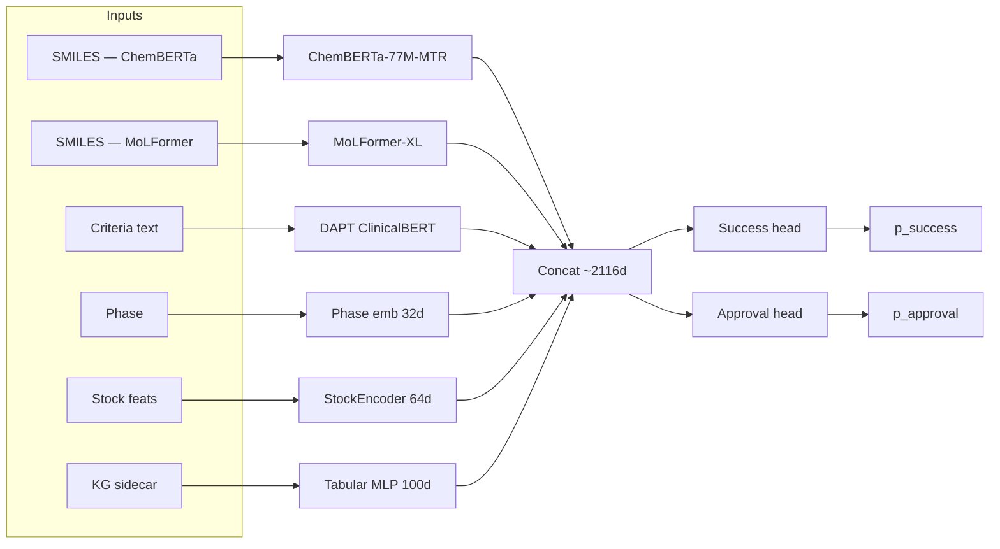
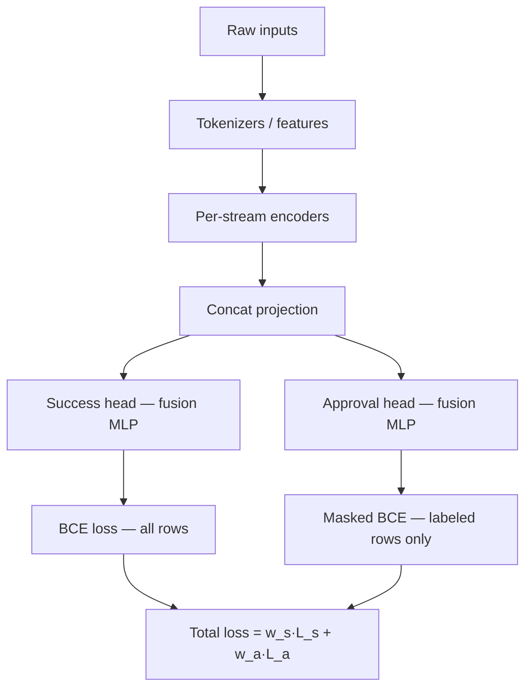
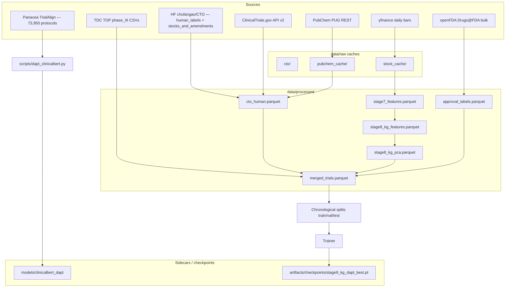
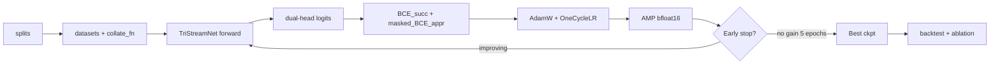
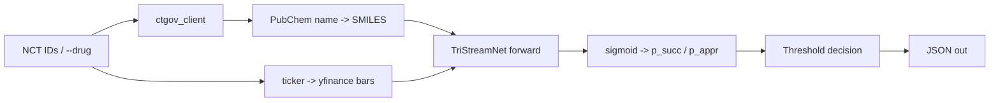
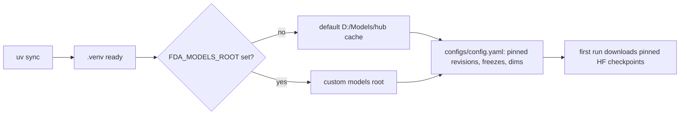
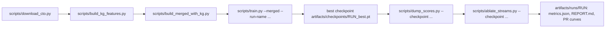
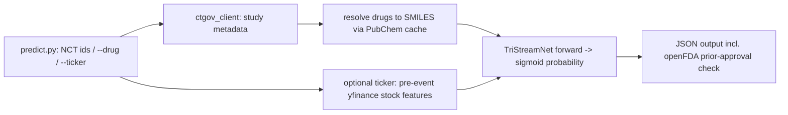

# FDA Predictor

Multimodal ML pipeline that predicts clinical-trial success / FDA approval probability from
publicly available trial metadata, molecule structures, eligibility-criteria text, sponsor
stock behaviour, and an oncology knowledge-graph sidecar. Two-head network with a dense
trial-success head and a sparse FDA-approval head (masked BCE), fused over five streams plus
a tabular KG block.

**Latest checkpoint (v13, stage-9):** val Phase-III AUPRC **0.8695**, test AUPRC **0.7782**
(P 0.792 / R 0.586 at the global threshold; tuned-P3 P 0.765 / R 0.864). Full readout in
[`REPORT_v13.md`](REPORT_v13.md).



## Contents

- [Architecture](#architecture)
- [Data pipeline](#data-pipeline)
- [Training pipeline](#training-pipeline)
- [Inference](#inference)
- [Results — v13](#results--v13)
- [Setup](#setup)
- [Offline pipeline (build, train, backtest)](#offline-pipeline)
- [Live inference](#live-inference-1)
- [Tests](#tests)
- [Module layout](#module-layout)
- [Key config knobs](#key-config-knobs)
- [Leakage-safety rules](#leakage-safety-rules)
- [Reproducibility](#reproducibility)

## Architecture

`TriStreamNet` (`src/fda_predictor/models/multimodal_net.py`, checkpoint layout 7) is the
five-stream encoder + dual-head classifier. Streams are projected into a shared concat vector
and split into two heads trained jointly under masked BCE.



Per-stream responsibilities:

| Stream | Backbone | Dim out | Notes |
|---|---|---|---|
| ChemBERTa | `DeepChem/ChemBERTa-77M-MTR` | 768 | Pinned revision; SMILES at 128 tokens |
| MoLFormer | `ibm-research/MoLFormer-XL-both-10pct` | 768 | Requires `trust_remote_code`; SMILES 128 tokens |
| ClinicalBERT | `emilyalsentzer/Bio_ClinicalBERT` **(DAPT'd)** | 768 | MLM-adapted on Panacea TrialAlign; 512 tokens |
| Phase | learnable embedding | 32 | {I, II, III, IV, UNK} |
| Stock | `StockEncoder` MLP | 64 | 7 pre-event yfinance features |
| Tabular (KG) | MLP | 100 | TxGNN-derived sidecar (PCA-100) for covered trials |

The success head uses the existing fusion MLP trained on all rows. The approval head is a
sibling MLP whose loss is applied only on rows with a verified Drugs@FDA label that were
not previously approved. Total loss = `w_s · BCE_succ + w_a · masked_BCE_appr`.

## Data pipeline



**Leakage-safe chronological splitting** (`data.merge_datasets.assert_merged_temporal_order`)
guarantees monotonic per-source eras. The train/val/test block is built inside the trainval
pool first, and the test era is held out untouched.

## Training pipeline



Training commands actually run in this repo (chronological):

| Stage | Run name | What changed |
|---|---|---|
| 1 | `stage1_merged_*` | Head-only warm-up over ChemBERTa + MoLFormer + ClinicalBERT |
| 2 | `stage2_clinicalbert_best` | Unfreeze ClinicalBERT, dense fusion MLP |
| 3 | `stage3_approval_tabular_best` | Add tabular approval head (single) |
| 4 | `stage4_dual_head_best` | Dual-head (layout 5), masked BCE for approval |
| 5 | `stage5_chem_unfrozen_best`, `stage5b_chem_covered_best` | Unfreeze ChemBERTa |
| 6 | `stage6_molfix_best` | MoLFormer fix |
| 7 | `stage7_mecha_sponsor_best` | Add mechanism + sponsor features |
| 8 | `stage8_kgtxgnn_best` | Add TxGNN KG sidecar (PCA-100, masked) |
| **9** | **`stage9_kg_dapt_best`** | **Swap ClinicalBERT for DAPT'd ClinicalBERT** |

## Inference

`scripts/predict.py` scores live trials. Inputs are NCT IDs (or a `--drug` search); it pulls
study metadata from ClinicalTrials.gov, resolves drug names to SMILES through the PubChem
cache, fetches pre-event stock bars if a `--ticker` is supplied, and emits both
`success_probability` and `approval_probability`.



## Results — v13

| Stage | Val P3 AUPRC | Test AUPRC | Test P | Test R | Tuned-P3 P | Tuned-P3 R |
|---|---|---|---|---|---|---|
| stage2 (head-only) | 0.832 | 0.764 | — | — | — | 0.842 |
| stage7 (mecha+sponsor) | 0.834 | 0.647 | 0.763 | 0.258 | 0.756 | 0.741 |
| stage8 (KG / TxGNN) | 0.829 | 0.639 | 0.749 | 0.295 | 0.757 | 0.671 |
| **stage9 (KG + DAPT CBERT)** | **0.870** | **0.778** | **0.792** | **0.586** | **0.765** | **0.864** |

Ablation v13 (delta = baseline − ablation; positive = removing hurts, negative = removing
helps slightly because the model has redundancy):

| Variant | P3 AUPRC | Δ |
|---|---|---|
| baseline | 0.8445 | — |
| tabular removed | 0.8259 | **+0.0186** ← biggest hit |
| chemistry single-feature dropped | 0.8374 | +0.0071 |
| legacy block zeroed | 0.8385 | +0.0060 |
| KG block zeroed | 0.8418 | +0.0027 |
| stock single-feature dropped | 0.8428 | +0.0017 |
| chemistry block zeroed | 0.8459 | −0.0014 |
| mechanism block zeroed | 0.8465 | −0.0020 |
| modality block zeroed | 0.8467 | −0.0022 |
| sponsor block zeroed | 0.8473 | −0.0028 |

The single-feature drops reveal what the *text* stream can't supply on its own: tabular
chemistry / stock / legacy descriptors matter. Sponsor / modality / mechanism blocks are
partially redundant under the DAPT encoder. The KG block contributes ~0.003 on top.

## Setup

Requires Python 3.11 and the [uv](https://docs.astral.sh/uv/) package manager. Model weights
cache under `D:\Models\hub` (override the root with the `FDA_MODELS_ROOT` env var);
`src/fda_predictor/utils/paths.py` sets `HF_HOME` / `HF_HUB_CACHE` defaults on import.

```powershell
uv sync
$env:FDA_MODELS_ROOT = "D:\Models"   # optional override; this is the default
```

Pinned revisions live in `configs/config.yaml`. The first training run downloads them into
the hub cache.



The DAPT'd ClinicalBERT (used by the v13 checkpoint) ships in this repo under
`models/clinicalbert_dapt/` (git-lfs, ~413 MB). It overrides the hub ClinicalBERT when
`encoders.clinicalbert.dapt_path` is set in `configs/config.yaml`.

## Offline pipeline

```powershell
# Build the CTO corpus: HuggingFace download + CTGov enrichment + PubChem SMILES (cached)
.venv\Scripts\python.exe scripts\download_cto.py

# Build the KG sidecar (TxGNN-derived, PCA-100) and merge into the merged parquet
.venv\Scripts\python.exe scripts\build_kg_features.py
.venv\Scripts\python.exe scripts\build_merged_with_kg.py

# (Optional) Domain-adaptive pretraining of ClinicalBERT on the Panacea TrialAlign corpus
.venv\Scripts\python.exe scripts\download_trialalign.py
.venv\Scripts\python.exe scripts\dapt_clinicalbert.py --max-docs 100000 --epochs 1

# Train the v13 model (no warm start — would overwrite the DAPT'd ClinicalBERT)
.venv\Scripts\python.exe scripts\train.py --merged --run-name stage9_kg_dapt

# Backtest on the untouched test era + ablation
.venv\Scripts\python.exe scripts\dump_scores.py --checkpoint stage9_kg_dapt_best.pt --run-name backtest_v13_kgdapt
.venv\Scripts\python.exe scripts\ablate_streams.py --checkpoint stage9_kg_dapt_best.pt --run-name ablation_v13 --split test
```

Useful overrides: `train.py` accepts `--max-epochs`, `--subset N`, `--batch-size`, `--lr`,
`--patience`, `--top-only`, `--init-checkpoint`; `dump_scores.py` accepts `--checkpoint
<path>`; `ablate_streams.py` accepts `--checkpoint`, `--split`, `--blocks`. Outputs land in
`artifacts/checkpoints/<run>_best.pt`, TensorBoard events in `artifacts/runs/<run>/` (view:
`uv run tensorboard --logdir artifacts/runs`), backtest reports (`metrics.json`, `REPORT.md`,
PR curves) in `artifacts/runs/<backtest-run>/`.



## Live inference

```powershell
.venv\Scripts\python.exe scripts\predict.py NCT04280705 NCT04634969 --ticker PFE --out preds.json
.venv\Scripts\python.exe scripts\predict.py --drug semaglutide
```

Output JSON includes `success_probability`, `approval_probability`, `decision`,
`decision_basis` (which head was used), and an openFDA prior-approval block.



## Tests

```powershell
.venv\Scripts\python.exe -m pytest tests\ -q
```

160 tests, ~35 s on a single thread. Integration-marked tests auto-skip when the local TDC
TOP data is absent.

## Module layout

| File | Role |
|---|---|
| `src/fda_predictor/models/multimodal_net.py` | TriStreamNet: five streams + dual heads, layout-7 save/load |
| `src/fda_predictor/models/encoders.py` | MoleculeEncoder x2, ProtocolEncoder, StockEncoder, tabular MLP; pinned backbone loading |
| `src/fda_predictor/models/fusion.py` | FusionClassifier MLP; raw logits out, sigmoid only at loss boundary |
| `src/fda_predictor/data/top_dataset.py` | TOP Phase III loading; chronological split by numeric NCT id |
| `src/fda_predictor/data/cto_dataset.py` | CTO download, human-label join, CTGov/PubChem enrichment, parquet build |
| `src/fda_predictor/data/merge_datasets.py` | Pooled TOP+CTO chronological merge, era/lookahead assertions |
| `src/fda_predictor/data/datasets.py` | Torch datasets + collator for TOP and merged corpora |
| `src/fda_predictor/data/tokenizers.py` | Encoder specs / tokenizers built from config; honors `dapt_path` |
| `src/fda_predictor/data/stock_features.py` | 7 pre-event stock features, train-only z-score stats |
| `src/fda_predictor/data/pubchem_smiles.py` | Drug name → canonical SMILES with on-disk cache |
| `src/fda_predictor/data/kg_features.py` | TxGNN-derived KG sidecar + PCA-100 + per-trial mask |
| `src/fda_predictor/training/trainer.py` | Training loop: AMP, grad accumulation, early stopping, TensorBoard, dual-head loss |
| `src/fda_predictor/training/backtest.py` | Checkpoint reload, threshold transfer, per-phase slices, dual-head scoring |
| `src/fda_predictor/training/losses.py` | Weighted BCE / focal loss builders, MultiTaskLoss (masked approval) |
| `src/fda_predictor/training/metrics.py` | AUPRC, threshold tuning, report formatting |
| `src/fda_predictor/inference/ctgov_client.py` | Batched ClinicalTrials.gov v2 client shared by ingestion and live path |
| `src/fda_predictor/utils/paths.py` | Path/cache governance; `FDA_MODELS_ROOT`, HF cache env defaults |

## Key config knobs (`configs/config.yaml`)

| Knob | Meaning |
|---|---|
| `encoders.chemberta/molformer/clinicalbert.freeze` | Stage-1 trains heads only; all backbones frozen (`true`) |
| `encoders.clinicalbert.dapt_path` | When set, loads the local DAPT'd ClinicalBERT (e.g. `D:/Models/clinicalbert_dapt`) instead of the hub revision |
| `encoders.*.revision`, `trust_remote_code`, `max_length` | Pinned hub revisions; MoLFormer needs remote code; 128 SMILES / 512 criteria tokens |
| `stock.n_features` / `emb_dim` / `freeze` | 7 pre-event yfinance features → 64-dim stream; never frozen in stage 1 |
| `fusion.phase_emb_dim` | 32-dim embedding over {I, II, III, IV, UNK} phases |
| `fusion.approval_hidden_dims` | Hidden dims of the approval head MLP (e.g. `[256]`) |
| `data.use_merged` | Pool TOP + CTO corpora (`true`); CLI flags `--merged` / `--top-only` override |
| `data.split_mode` / `temporal_split` | Chronological, guard-enforced; `benchmark` mode exists but is not chronological |
| `data.val_fraction_of_trainval` | Val carve-out (0.15) inside the chronological trainval block |
| `training.loss` | `weighted_bce` (default) or `focal`; `metric_for_best: val_auprc` selects checkpoints |
| `labels.target` | `dual` trains both heads; `success` (legacy) trains only the dense head |
| `labels.success_weight` / `labels.approval_weight` | Total loss = `w_s·L_s + w_a·L_a` |
| `labels.exclude_previously_approved` | Drops rows where the trial drug was already FDA-approved before start |
| `compute.gradient_checkpointing` | Off by default; enable when unfreezing backbones on 8 GB VRAM |
| `cto.fetch_ctgov` / `resolve_smiles` / `max_drugs_pubchem` | Enrichment toggles used during data builds |

## Leakage-safety rules

1. **Chronological splits.** TOP orders by numeric NCT id, CTO by its own chronology date;
   `assert_merged_temporal_order` enforces monotonic per-source eras with explicit LOOKAHEAD
   errors, guarded by unit tests.
2. **Pre-event-only stock windows.** All 7 stock features are computed from daily bars
   strictly before the trial completion date; CTO's post-completion price slope is never an
   input.
3. **Train-only normalization.** Stock-feature mean/std are fit on the train split only and
   then applied to val/test. The KG PCA is fit on the covered train rows only.
4. **Threshold transfer.** Decision thresholds are tuned on the validation split only, then
   frozen for test scoring; classical baselines likewise fit on train statistics only.
5. **Approval mask.** The approval head sees only rows with a verified Drugs@FDA label that
   were not previously approved; rows without a label contribute zero loss.

## Reproducibility

To rerun the v13 model from scratch on a clean checkout:

```powershell
# 1. (One-time) Download corpora + DAPT
.venv\Scripts\python.exe scripts\download_cto.py
.venv\Scripts\python.exe scripts\download_trialalign.py
.venv\Scripts\python.exe scripts\dapt_clinicalbert.py --max-docs 100000 --epochs 1

# 2. (One-time) Build KG sidecar + merged parquet
.venv\Scripts\python.exe scripts\build_kg_features.py
.venv\Scripts\python.exe scripts\build_merged_with_kg.py

# 3. Train (no warm start — would overwrite the DAPT'd ClinicalBERT)
.venv\Scripts\python.exe scripts\train.py --merged --run-name stage9_kg_dapt

# 4. Backtest + ablation
.venv\Scripts\python.exe scripts\dump_scores.py --checkpoint stage9_kg_dapt_best.pt --run-name backtest_v13_kgdapt
.venv\Scripts\python.exe scripts\ablate_streams.py --checkpoint stage9_kg_dapt_best.pt --run-name ablation_v13 --split test
```

Environment:
- Python 3.11 (`uv sync`)
- GPU recommended (8 GB VRAM suffices with `compute.gradient_checkpointing: true`)
- Cache locations: `D:\Models` (weights) and `D:\datasets` (corpora); override with
  `FDA_MODELS_ROOT` if needed.

## License

See `LICENSE` (research / academic use; redistribute only with attribution).
